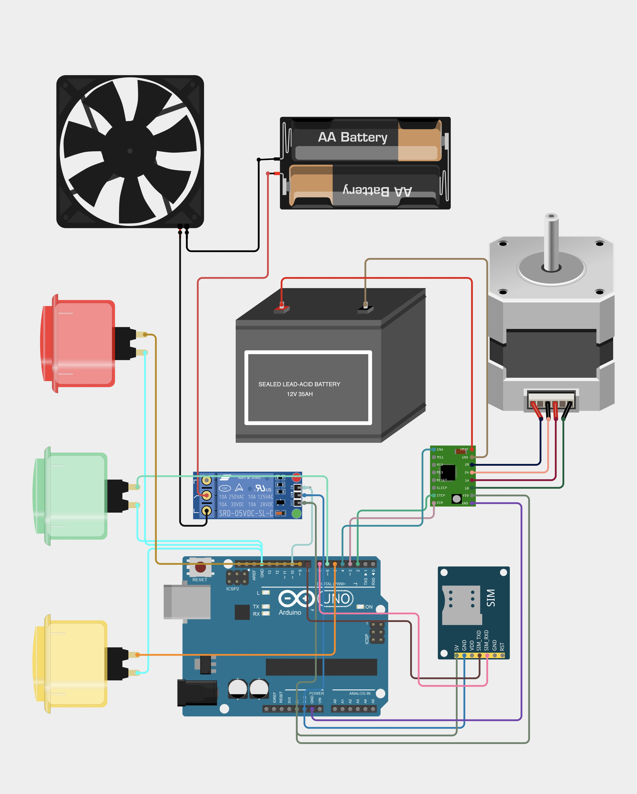

# Power Monitoring and Fuse System

This project is an automatic power monitoring and control system built on the Arduino platform. It is designed to function as a "smart fuse," detecting power failures or cable cuts and physically disconnecting the power line using a stepper motor. It also sends SMS alerts for both automatic and manual events.

## Features

- **Automatic Power Cut Detection:** A sensor monitors the power line. If a failure is detected, the system automatically triggers the stepper motor.
- **Stepper Motor Actuator:** A stepper motor acts as a physical switch or "fuse," rotating to disconnect the power carrier upon failure.
- **GSM SMS Alerts:** The system sends real-time SMS notifications to a pre-configured phone number for events like:
    - Automatic power cut detection.
    - Manual motor activation.
    - System startup.
- **Manual Override Controls:** Three push buttons allow for manual control:
    - **Clockwise Rotation:** Manually trigger the "fuse" and disconnect power.
    - **Anti-Clockwise Rotation:** Reset the system by retracting the motor.
    - **SMS Function:** A reserved button for future SMS features.
- **Development and Testing Code:** The repository includes several test scripts used during development.

## How It Works

The main logic is in the `powermonitoring_2/powermonitoring_2.ino` file.

1.  **Monitoring:** The Arduino continuously reads the state of a relay sensor connected to `RELAY_SENSOR_PIN` (Pin 10).
2.  **Detection:** If the sensor signal goes `LOW`, the system interprets it as a power cut.
3.  **Action:**
    - The stepper motor is activated to rotate clockwise for 10 full revolutions, physically disconnecting the circuit.
    - An SMS alert is sent, notifying the user of the automatic disconnection.
4.  **Manual Control:** Users can trigger the motor clockwise or anti-clockwise using push buttons, with the clockwise action also sending an SMS.

## Components

- **Microcontroller:** Arduino UNO or a compatible board.
- **Stepper Motor:** NEMA 17 or similar.
- **Stepper Motor Driver:** A4988.
- **GSM Module:** SIM800L or a similar module for SMS communication.
- **Sensor:** A relay module or a custom sensor to detect the power line's status.
- **Push Buttons:** For manual intervention.
- **Power Supply:** Separate power sources for the Arduino, GSM module, and stepper motor.

## Setup and Configuration

1.  **Hardware:** Assemble the circuit as shown in the diagram below.
    
    

2.  **Software:**
    - Open the `powermonitoring_2/powermonitoring_2.ino` file in the Arduino IDE.
    - **IMPORTANT:** Before uploading, you must set your own phone number in the code. Find the following line and replace the placeholder with your number:
      ```cpp
      String phoneNumber = "YOUR_PHONE_NUMBER"; // Replace with your phone number
      ```
    - Upload the sketch to your Arduino board.

3.  **Operation:**
    - Once powered on, the system will initialize and send a startup SMS.
    - It will then monitor the power line and respond to manual button presses.

## Code Overview

- **`powermonitoring_2/powermonitoring_2.ino`**: The main, complete code for the project.
- **`powermonitoring_1/powermonitoring_1.ino`**: An earlier development version focused on button controls.
- **`steper_test/steper_test.ino`**: A simple script for testing the stepper motor functionality.
- **`test_1/test_1.ino`**: A script for testing relay-based motor control.